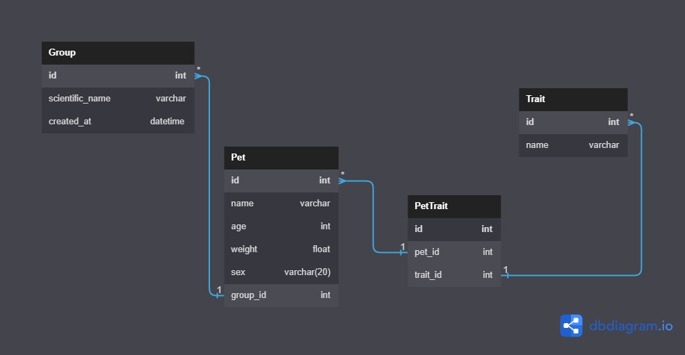

# Pet Kare

# Projeto Semanal | Pet Kare

## Tópicos do Conteúdo
1. [Introdução](#introdução)
2. [Rotas](#rotas)
3. [Visão Geral](#visão-geral)
4. [Relacionamentos](#relacionamentos)
5. [Como rodar os testes localmente](#Como-rodar-os-testes-localmente)
---

## Introdução

O desafio foi criar um sistemas para petshops. A franquia PetKare enfrenta desafios com processos manuais e informações desorganizadas sobre os animais de seus clientes. Para solucionar isso, o PetKare solicitou ajuda para implementar uma API que permita um maior controle e organização dos dados dos animais.

A API foi desenvolvida y testada con fines academicos.

---

## Rotas

| Endpoint         | Verbo HTTP | Objetivo                                          |
|------------------|------------|---------------------------------------------------|
| api/pets/        | POST       | Cadastrar pet                                    |
| api/pets/        | GET        | Listar pet                                      |
| api/pets/?trait=nome_da_trait ou api/pets?trait=nome_da_trait | GET | Filtragem de pets que possuem a trait passada por query param |
| api/pets/<pet_id>/ | GET       | Busca de pet                                    |
| api/pets/<pet_id>/ | PATCH     | Atualização de pet                              |
| api/pets/<pet_id>/ | DELETE    | Deleção de pet                                 |

---

## Visão Geral

- Configuração básica do projeto, incluindo boas práticas como .gitignore, requirements.txt
- Diagrama de Entidade e Relacionamento na raiz do repositório no formato JPEG, JPG, PNG ou outro que facilite a visualização.
- Relacionamentos entre pets, grupos e características.
- Serializadores para validação, entrada e saída de dados para pets, grupos e características.
- Views de criação, listagem, filtragem, busca, atualização e deleção de pets, recebendo informações de três tabelas de uma vez, com filtro na listagem.
- Tratamento de exceção nas rotas de criação, atualização, filtragem e deleção.

---

# Relacionamentos

### DER



## Implementação dos Relacionamentos


1. Um grupo (group) pode ter vários pets atrelados a ele, porém um pet somente poderá estar conectado a um grupo.

   **Criação da Model Group:**

   - Atributos:
     - `scientific_name`: string, tamanho máximo 50, único.
     - `created_at`: data e tempo, preenchida automaticamente com a data e hora em que o objeto foi criado.

2. Uma característica (trait) pode estar ligada a vários pets assim como um pet pode possuir várias características.

   **Criação da Model Trait:**

   - Atributos:
     - `name`: string, tamanho máximo 20, único.

3. Para criar um animal, deve ser obrigatório associar um grupo a ele. A modalidade de deleção deve proteger os registros de pet/grupos. Não deve ser possível deletar um grupo diretamente, sem antes deletar todas os pets associados ao grupo.

   **Criação da Model Pet:**

   - Atributos:
     - `name`: string, tamanho máximo 50.
     - `age`: inteiro.
     - `weight`: float.
     - `sex`: string, tamanho máximo 20, com opções Male, Female e Not Informed (valor padrão).


## Como rodar os testes localmente

- Verifique se os pacotes pytest e/ou pytest-testdox estão instalados globalmente em seu sistema:

```shell
pip list
```

- Caso seja listado o pytest e/ou pytest-testdox e/ou pytest-django em seu ambiente global, utilize os seguintes comando para desinstalá-los globalmente:

```shell
pip uninstall pytest pytest-testdox -y
```

<hr>

## Próximos passos:

### 1 Clone e instale o projeto

### 2 Crie seu ambiente virtual:

```shell
python -m venv venv
```

### 3 Ative seu venv:

```shell
# linux:
source venv/bin/activate

# windows (powershell):
.\venv\Scripts\activate

# windows (git bash):
source venv/Scripts/activate
```

### 4 Instalar o pacote <strong>pytest-testdox</strong>:

```shell
pip install pytest-testdox pytest-django
```

### 5 Rodar os testes referentes a cada tarefa isoladamente:

Exemplo:

- Tarefa 1

```shell
pytest --testdox -vvs tests/tarefas/tarefa_1/
```

- Tarefa 2

```shell
pytest --testdox -vvs tests/tarefas/tarefa_2/
```

- Tarefa 3

```shell
pytest --testdox -vvs tests/tarefas/tarefa_3/
```

Você também pode rodar cada método de teste isoladamente seguindo uma substring, adicionando a flag `-k` seguido da substring a ser encontrada
(atenção, se o pytest achar multiplos métodos que contenham a mesma substring em seu nome, ele executará todos):

```shell
pytest --testdox -vvsk test_can_not_create_pet_when_missing_keys
```

<hr>

Você também pode rodar cada método de teste isoladamente:

```shell
pytest --testdox -vvs caminho/para/o/arquivo/de/teste::NomeDaClasse::nome_do_metodo_de_teste
```

Exemplo: executar somente "test_can_get_product_by_id".

```shell
pytest --testdox -vvs tests/tarefas/tarefa_1/test_get_product_by_id.py::TestGetProductById::test_can_get_product_by_id
```
